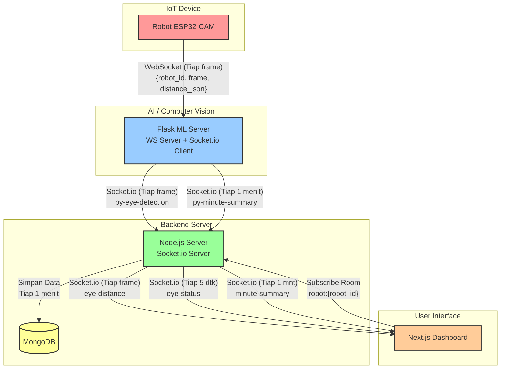
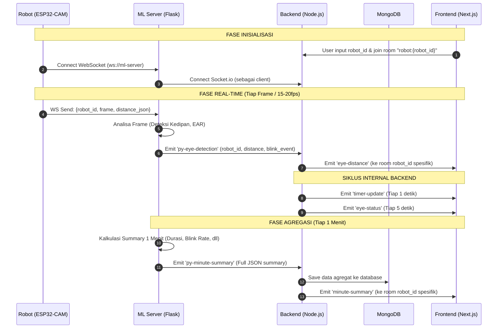

# 📊 Diagram Arsitektur & Alur Data Final SocaSob

Berikut adalah visualisasi arsitektur dan alur data dari sistem SocaSob berdasarkan keputusan final.

---

## 1. Diagram Arsitektur Sistem (System Architecture)

Diagram ini menunjukkan bagaimana setiap komponen saling terhubung dan protokol apa yang digunakan.

---

## 2. Diagram Urutan (Sequence Diagram)

Diagram ini menunjukkan urutan waktu kapan data dikirim dari satu titik ke titik lainnya, terbagi menjadi siklus frame (real-time) dan siklus menit (agregasi).

