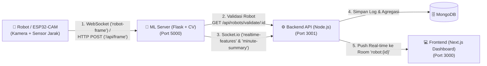

# Panduan Integrasi & Koneksi Robot SocaSob (ESP32-CAM ke ML & Backend)

Dokumen ini menjelaskan spesifikasi arsitektur, protokol komunikasi, format payload, dan contoh kode untuk menghubungkan perangkat robot (ESP32-CAM / Edge Device / Simulator) ke **ML Server (Python)** dan **Backend Server (Node.js)** pada ekosistem **SocaSob**.

---

## 1. Arsitektur Alur Data (End-to-End)



### Rincian Peran Tiap Komponen:
1. **Robot (ESP32-CAM / Device)**: Mengambil gambar (frame JPEG) dan membaca perkiraan jarak mata (`Dekat` / `Jauh`), lalu mengirimkannya ke **ML Server**.
2. **ML Server**: Memproses frame dengan Computer Vision (Eye Aspect Ratio / Blink Detection / Head Pose / Fatigue Detection), memvalidasi status robot ke Backend, dan mengirimkan hasil olahan fitur ke **Backend Server**.
3. **Backend Server**: Menerima fitur real-time, mengelola database robot & riwayat log, serta meneruskan data ke **Frontend Dashboard** secara *live* melalui Socket.IO room `robot:<robot_id>`.
4. **Frontend Dashboard**: Menampilkan timer, skor kesehatan mata, status jarak real-time, dan grafik analitik kepada pengguna.

---

## 2. Langkah 1: Registrasi Perangkat (Robot ID)

Sebelum robot dapat mengirimkan data ke ML server, **`robotId` (Hardware ID / MAC Address)** harus terdaftar dan berstatus aktif di database Backend.

### Cara A: Melalui Web Dashboard Frontend
1. Buka dashboard SocaSob di browser.
2. Navigasi ke menu **Perangkat** (`/devices`) atau **Pengaturan** (`/settings`).
3. Klik tombol **Tambah Perangkat** / isi **Robot ID** (contoh: `fadfa566` atau MAC `A4CF12832E01`).
4. Klik **Simpan & Hubungkan**.

### Cara B: Melalui REST API Backend
Kirim request HTTP POST ke backend:
```bash
curl -X POST https://be-socasob.hallojanu.xyz/api/robots \
  -H "Content-Type: application/json" \
  -d '{
    "robotId": "fadfa566",
    "name": "SocaSob ESP32-CAM Ruang Belajar",
    "description": "Perangkat monitoring meja belajar",
    "status": "active"
  }'
```

> [!NOTE]
> ML Server memiliki lapisan keamanan (**Security Gate**): Jika robot yang belum terdaftar atau berstatus `inactive` mencoba mengirim frame, ML Server akan menolak frame tersebut secara otomatis.

---

## 3. Langkah 2: Protokol Koneksi Robot ke ML Server

Robot dapat mengirim data ke ML Server menggunakan salah satu dari dua metode:

### Metode 1: WebSocket / Socket.IO (Direkomendasikan untuk Real-time)
* **URL Target**: `ws://<ML_HOST>:<ML_PORT>/socket.io/?EIO=4&transport=websocket` atau via Socket.IO Client.
* **Event Name**: `robot-frame` atau `esp32_frame`
* **Format Payload**:
```json
{
  "robot_id": "fadfa566",
  "frame": "<binary buffer JPEG atau Base64>",
  "distance_json": {
    "distance": "Dekat",
    "confidence": 95
  }
}
```

* Nilai `distance`: `"Dekat"` (jarak mata terlalu dekat, risiko miopia/fatigue) atau `"Jauh"` (jarak aman normal).
* Nilai `confidence`: Nilai keyakinan 0–100.

---

### Metode 2: HTTP Stream / MJPEG Adapter (Mode `VIDEO_SOURCE=esp32`)
Jika ESP32-CAM menjalankan server web lokal (seperti contoh sketch standar CameraWebServer Arduino):
* Konfigurasi di ML Server `.env`:
  ```bash
  VIDEO_SOURCE=esp32
  ESP32_STREAM_URL=http://192.168.1.100:81/stream
  ```
* Kelas [`ESP32Camera`](file:///Users/mrfrog/Documents/Lomba/PKM/ml/camera/esp32_camera.py) akan otomatis menarik stream video MJPEG secara kontinu dan memproses pipeline MediaPipe.

---

### Metode 3: HTTP POST REST API (`/api/frame`)
Jika perangkat mikrokontroler memiliki keterbatasan memori untuk mempertahankan koneksi WebSocket terus-menerus, dapat menggunakan HTTP POST:

* **URL Target**: `POST http://<ML_HOST>:<ML_PORT>/api/frame`
* **Opsi A (Multipart/Form-Data)**:
  * Field `image` / `frame`: File binary JPEG
  * Field `robot_id`: `fadfa566`
  * Field `distance`: `Dekat` atau `Jauh`
  * Field `confidence`: `90`
* **Opsi B (JSON Payload)**:
```json
{
  "robot_id": "fadfa566",
  "frame": "data:image/jpeg;base64,/9j/4AAQSkZJRg...",
  "distance_json": {
    "distance": "Jauh",
    "confidence": 88
  }
}
```

---

## 4. Contoh Implementasi Kode

### A. Contoh Kode ESP32-CAM (Arduino C++)

```cpp
#include "esp_camera.h"
#include <WiFi.h>
#include <HTTPClient.h>

// Konfigurasi WiFi
const char* ssid = "WIFI_SSID";
const char* password = "WIFI_PASSWORD";

// Konfigurasi Endpoint ML Server
const char* mlServerUrl = "http://192.168.1.50:5000/api/frame";
const char* robotId = "fadfa566"; // MAC Address / Hardware ID perangkat

void setup() {
  Serial.begin(115200);
  
  // 1. Inisialisasi WiFi
  WiFi.begin(ssid, password);
  while (WiFi.status() != WL_CONNECTED) {
    delay(500);
    Serial.print(".");
  }
  Serial.println("\nWiFi Terhubung!");

  // 2. Inisialisasi Kamera OV2640
  camera_config_t config;
  config.ledc_channel = LEDC_CHANNEL_0;
  config.ledc_timer = LEDC_TIMER_0;
  config.pin_d0 = 5;
  config.pin_d1 = 18;
  config.pin_d2 = 19;
  config.pin_d3 = 21;
  config.pin_d4 = 36;
  config.pin_d5 = 39;
  config.pin_d6 = 34;
  config.pin_d7 = 35;
  config.pin_xclk = 0;
  config.pin_pclk = 22;
  config.pin_vsync = 25;
  config.pin_href = 23;
  config.pin_sscb_sda = 26;
  config.pin_sscb_scl = 27;
  config.pin_pwdn = 32;
  config.pin_reset = -1;
  config.xclk_freq_hz = 20000000;
  config.pixel_format = PIXFORMAT_JPEG;
  config.frame_size = FRAMESIZE_QVGA; // 320x240 (optimal untuk inferensi cepat)
  config.jpeg_quality = 12;
  config.fb_count = 1;

  esp_err_t err = esp_camera_init(&config);
  if (err != ESP_OK) {
    Serial.printf("Kamera gagal diinisialisasi: 0x%x\n", err);
    return;
  }
}

void sendFrameToML(camera_fb_t *fb, String distanceStatus, int confidenceVal) {
  if (WiFi.status() != WL_CONNECTED) return;

  HTTPClient http;
  http.begin(mlServerUrl);
  
  String boundary = "----WebKitFormBoundarySocaSob7MA4YWxkTrZu0gW";
  http.addHeader("Content-Type", "multipart/form-data; boundary=" + boundary);

  // Buat body multipart
  String head = "--" + boundary + "\r\n" +
                "Content-Disposition: form-data; name=\"robot_id\"\r\n\r\n" + robotId + "\r\n" +
                "--" + boundary + "\r\n" +
                "Content-Disposition: form-data; name=\"distance\"\r\n\r\n" + distanceStatus + "\r\n" +
                "--" + boundary + "\r\n" +
                "Content-Disposition: form-data; name=\"confidence\"\r\n\r\n" + String(confidenceVal) + "\r\n" +
                "--" + boundary + "\r\n" +
                "Content-Disposition: form-data; name=\"image\"; filename=\"frame.jpg\"\r\n" +
                "Content-Type: image/jpeg\r\n\r\n";
  String tail = "\r\n--" + boundary + "--\r\n";

  size_t totalLen = head.length() + fb->len + tail.length();
  uint8_t *buf = (uint8_t *)malloc(totalLen);
  if (!buf) {
    http.end();
    return;
  }

  memcpy(buf, head.c_str(), head.length());
  memcpy(buf + head.length(), fb->buf, fb->len);
  memcpy(buf + head.length() + fb->len, tail.c_str(), tail.length());

  int httpCode = http.POST(buf, totalLen);
  free(buf);

  if (httpCode > 0) {
    Serial.printf("[HTTP] Status kirim frame: %d\n", httpCode);
  } else {
    Serial.printf("[HTTP] Gagal kirim: %s\n", http.errorToString(httpCode).c_str());
  }
  http.end();
}

void loop() {
  camera_fb_t *fb = esp_camera_fb_get();
  if (!fb) {
    Serial.println("Gagal capture frame kamera");
    delay(1000);
    return;
  }

  // Contoh pembacaan status jarak (dari sensor ultrasonic/ToF atau threshold)
  String currentDistance = "Jauh"; 
  int confidence = 92;

  sendFrameToML(fb, currentDistance, confidence);
  esp_camera_fb_return(fb);

  // Kirim frame setiap 100ms (~10 FPS)
  delay(100); 
}
```

---

### B. Menggunakan Script Simulator Robot (Python)

Untuk menguji tanpa hardware fisik, gunakan simulator bawaan di direktori `ml/`:

```bash
# Instal dependency simulator jika belum
pip install websocket-client opencv-python-headless numpy

# Jalankan simulator
python3 ml/robot_simulator.py --ml-url http://localhost:5000 --robot-id fadfa566 --fps 10
```

---

## 5. Endpoint Debugging & Monitoring

| Endpoint | Method | Layanan | Deskripsi |
| :--- | :--- | :--- | :--- |
| `/health` | GET | ML & BE | Cek status kesehatan server |
| `/video_feed` | GET | ML Server | Stream visual MJPEG langsung dari frame robot |
| `/api/features` | GET | ML Server | Cek data ekstraksi fitur CV terkini (EAR, blink, pose) |
| `/api/robots` | GET | Backend | Daftar seluruh robot terdaftar beserta status online |
| `/api/robots/:id/status` | GET | Backend | Cek apakah robot `:id` online dan aktif di room Socket |
| `/api/robots/validate/:id` | GET | Backend | Endpoint validasi internal yang dipanggil ML Server |

---

## 6. Panduan Troubleshooting (Masalah Umum)

### 1. Status Robot Tetap Offline di Dashboard
* **Penyebab**: Robot belum terdaftar di Backend atau event `subscribe-robot` di frontend belum menerima stream data.
* **Solusi**:
  1. Pastikan `robotId` yang dikirim dari robot sama persis dengan yang dimasukkan di halaman Pengaturan/Perangkat Dashboard.
  2. Buka `http://<ML_IP>:5000/api/features` untuk memastikan ML berhasil menerima frame dari robot.
  3. Cek log ML (`app.py`): Pastikan koneksi Socket.IO client ke Backend (`settings.BE_URL`) tersambung (`is_connected: True`).

### 2. Error: "Frame ditolak: Robot belum terdaftar atau inaktif di sistem"
* **Penyebab**: `robot_id` belum didaftarkan di Backend atau statusnya `inactive`.
* **Solusi**: Daftarkan robot melalui dashboard atau REST API `POST /api/robots`.

### 3. ML Server Gagal Terhubung ke Backend (`Connection refused` / `Socket Disconnected`)
* **Penyebab**: Nilai environment variable `BE_URL` di ML Server belum sesuai.
* **Solusi**: Periksa file `.env` di direktori `ml/` dan sesuaikan URL backend (misal: `BE_URL=http://localhost:3001` atau `http://be:3001`).
